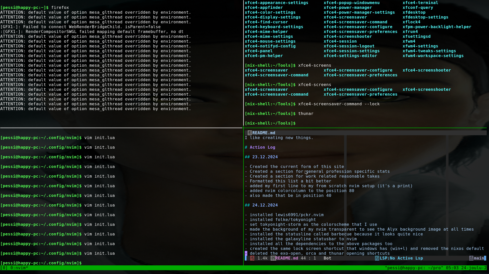

# Profile

- Name: Pessi
- Profession: Software Developer
- Other possible jobs: Tech support, Networking specialist, Salesperson, Tech lead
- Faction: WAITING TO BE RECRUITED
- Role in Faction: N/A

# Stats (2025)

- Github repositories created: 0
- Github commits commited in: 0
- Languages used in commits: None
- Repositories forked: 0
- Pull requests created: 0
- Hours used to work: 0

# Opinions gathered while working with their specific reasonings

I like creating new things.

# A picture to show you approximately what my screen looks like right now

# Action Log

## 23.12.2024

- Created the current form of this site
- Created a section for general profession specific stats
- Created a section for work related reasonable takes
- Formatted this list a bit better
- added my first line to my from scratch nvim setup (it's a print)
- added nvim colorcolumn to the position 80
- also made that be in position 40

## 24.12.2024

- installed lewis6991/pckr.nvim
- installed folke/tokyonight
- set tokyonight-storm as the colorscheme that I use
- made the background of my nvim transparent to see the Alyx background image at all times
- installed the statusline called barbecue because it looks quite nice
- installed the galaxyline statusbar to nvim
- installed all the dependencies to the above packages too
- created the same lock screen shortcut that windows has (win+l) and removed the nixos default
- deleted the exo-open, orca and thunar opening shortcuts
- created a section for giving the viewer a feel to what my experience looks like
- installed williamboman/mason.nvim
- made the cursor size massive for the lulz

## 25.12.2024

- Had myself a merry little christmas
- installed emacs

## 26.12.2024
